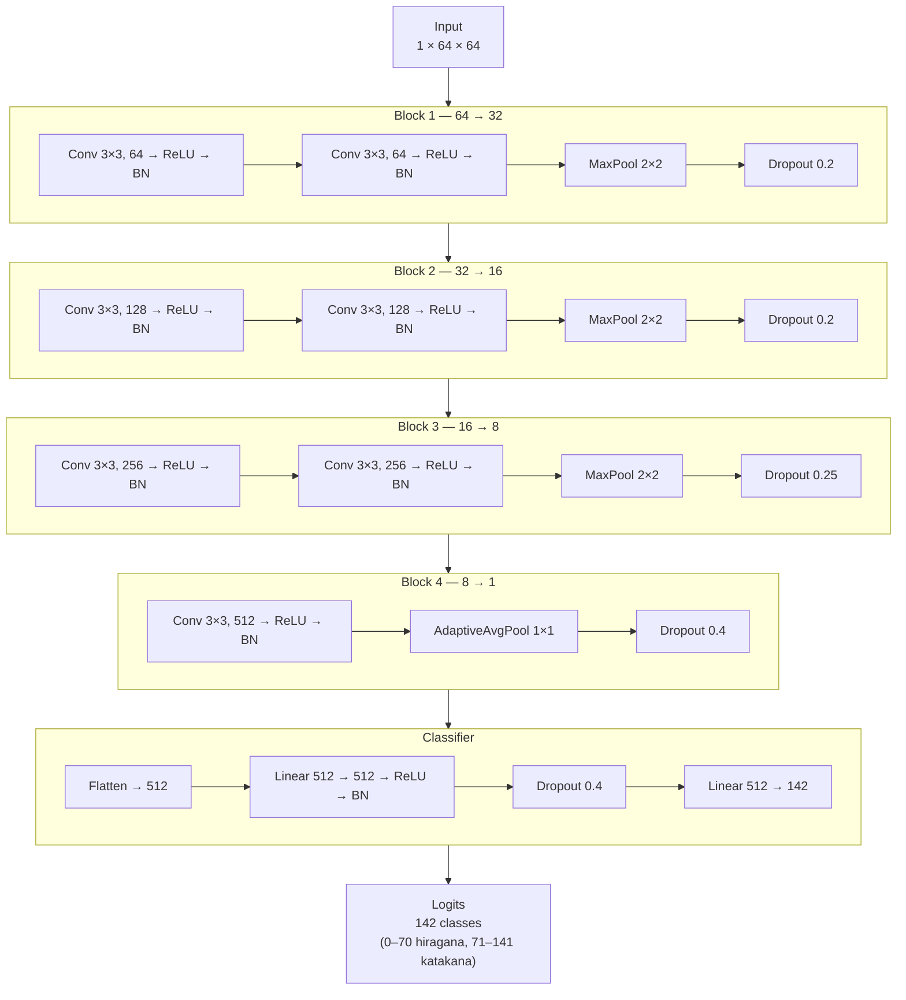

# train-kana-model

Training pipeline for KanaSnap's handwriting recognition model. Produces a single ONNX model that classifies all **142 single kana** (71 hiragana + 71 katakana) from a 64×64 grayscale stroke image.

The model is loaded at runtime by `src/lib/kanaModel.ts` via ONNX Runtime Web and served from `public/model/kana/model.onnx`.

## Requirements

- Python 3.10 – 3.12
- [uv](https://github.com/astral-sh/uv) (recommended) or `pip`
- Japanese-capable fonts installed system-wide, or a `fonts/` directory next to this script

## Quick start

```bash
cd scripts/train-kana-model
uv sync
uv run python train_kana_model.py
```

The trained model is written to `public/model/kana/model.onnx`.

## CLI options

| Flag | Default | Description |
| --- | --- | --- |
| `--fonts-dir` | auto-detect | Directory containing Japanese `.ttf`/`.otf`/`.ttc` fonts |
| `--output-dir` | `public/model` | Where to write `<kana_type>/model.onnx` |
| `--epochs` | `80` | Max training epochs (early stopping after 15-epoch plateau) |
| `--samples-per-font` | `80` | Augmented samples per font per character |
| `--dataset-dir` | — | Optional directory of real handwritten samples (subfolders named by unicode hex, e.g. `0x3042/`) |
| `--cache-dir` | `.sample_cache/` | Per-font sample cache location (pass empty string to disable) |
| `--no-cache` | off | Disable the sample cache entirely |
| `--rebuild-cache` | off | Regenerate all cached samples |

## Data pipeline

1. Discover Japanese-capable fonts (macOS / Linux / Windows).
2. Render each of the 142 kana in each font, then apply heavy augmentation per sample: elastic distortion, random perspective warp, affine jitter, stroke thinning/thickening, blur, and noise.
3. Optionally mix in real handwritten samples from `--dataset-dir`.
4. Resize to 64×64, normalize to `[0, 1]`, split 90 / 10 train / val.

## Model architecture

Four conv blocks + a linear classifier. Input is a single-channel 64×64 image, output is logits over 142 classes.



## Training recipe

- **Optimizer**: Adam, initial LR `3e-4`
- **Schedule**: linear warmup (8 epochs) → cosine annealing
- **Loss**: cross-entropy with label smoothing (`0.1`)
- **Batch size**: 64 train / 256 val
- **Regularization**: dropout per block + BN throughout
- **Early stopping**: 15-epoch patience on val accuracy

## Export

Best-validation weights are exported to ONNX with:

- `opset_version=17`
- `input` name: `input`, shape `[batch_size, 1, 64, 64]`
- `output` name: `output`, shape `[batch_size, 142]`
- dynamic `batch_size` axis

The output logit order **must match** `SINGLE_KANA` in `src/lib/kanaModel.ts` — hiragana first (indices 0–70), then katakana (71–141), each in gojuon → dakuten → handakuten order.
